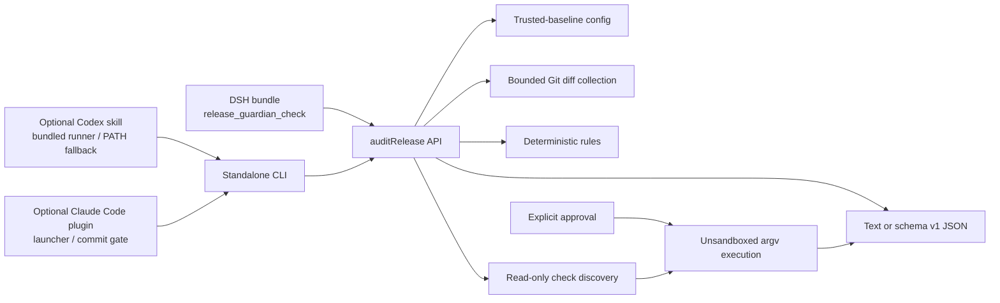

# Architecture

Release Guardian has one scanning core and four entry-point adapters. The adapters differ in how a request enters the system; they do not implement separate rule sets or verdict logic.

## Components

| Component | Source / artifact | Responsibility |
| --- | --- | --- |
| Core API | `src/core/` and `auditRelease` | Resolve the repository, load policy, collect a bounded diff, apply rules, discover checks, optionally execute approved plans, and determine a verdict. |
| Standalone CLI | `src/cli.ts` → `lib/cli.js` | Parse CLI options, render text or JSON, prompt before execution, and map verdicts to exit codes. |
| DSH adapter | `src/index.ts` + `cordis.patch.yml` | Register `release_guardian_check`, validate structured input, and add the host approval gate for `action: "run"`. |
| Codex adapter | `.codex-plugin/plugin.json` + `skills/release-guardian/` | Teach Codex the safe scan/approval workflow and invoke the packaged runner. It is optional and does not participate in DSH startup. |
| Claude Code adapter | `.claude-plugin/`, `agents/`, `bin/`, and `hooks/` | Reuse the skill and scanner through a session launcher, read-only audit subagent, and opt-in static pre-commit gate. |

## Entry points

### DeepSeek Harness bundle

The npm package declares its DSH bundle patch in `package.json`. `cordis.patch.yml` activates the built plugin, and the plugin registers `release_guardian_check`. Discovery and execution are separate tool actions. A run must contain exact command IDs returned by a current discovery response.

### Standalone CLI

The `dsh-release-guardian` executable is the direct interface to the same core. It defaults to a read-only `check`. `--run-checks` crosses the project-code execution boundary; an interactive confirmation or `--yes` in a non-interactive process is then required.

### Optional Codex adapter

`.codex-plugin/plugin.json` identifies the `skills/` directory and UI metadata to Codex. The `release-guardian` skill prefers the self-contained bundled runner at `skills/release-guardian/scripts/release-guardian.mjs`; if that companion script is unavailable, the adapter can fall back to a compatible `dsh-release-guardian` executable on `PATH`.

The manifest exists so one release artifact can expose a guided Codex workflow without making Codex a dependency of the core or DSH adapter. It does not grant check execution. If a user copies the skill directly, the copy must contain both `SKILL.md` and `scripts/release-guardian.mjs`; otherwise only the `PATH` fallback can work.

### Optional Claude Code plugin

`.claude-plugin/plugin.json` declares the plugin and `.claude-plugin/marketplace.json` publishes this repository as a single-plugin marketplace. The plugin reuses `skills/release-guardian/`, adds a read-only `agents/release-auditor.md` subagent, and exposes `bin/dsh-release-guardian` on the Bash tool's `PATH`.

`bin/dsh-release-guardian` and `scripts/claude-commit-gate.mjs` share the resolution in `scripts/guardian-cli-path.mjs`: an explicit override, then the self-contained bundled runner, then `lib/cli.js`, then a `dsh-release-guardian` on `PATH`. The bundled runner precedes `lib/cli.js` because Claude Code installs plugin dependencies with `npm ci --ignore-scripts` and skips the install entirely without a lockfile, so `lib/cli.js` can exist without its dependencies. Claude Code never runs a build, so an install shape without built output resolves through `PATH` or fails with an actionable message.

`hooks/hooks.json` registers one `PreToolUse` hook on `git commit`. It is inert unless the `commit_gate` option is on, it reuses the same read-only `check` path, and it never crosses the project-code execution boundary. Any failure allows the commit and reports that the gate did not run.

## Audit flow

1. Resolve the requested path to the canonical Git repository root.
2. Resolve the diff mode and its baseline (`HEAD` or the merge base).
3. Read `.release-guardian.yml` from the trusted baseline, not from a newly modified working copy.
4. Collect changed-file metadata and relevant added lines with Git's external diff/text-conversion hooks disabled.
5. Enforce byte, file, finding, and discovery limits. Incomplete coverage fails closed to `inconclusive`.
6. Apply deterministic rules and redact secret evidence.
7. Discover project checks by reading manifests. Discovery does not run package scripts or install dependencies.
8. Bind each check ID to the canonical repository, effective policy, manifest, and diff fingerprint.
9. If and only if execution is explicitly authorized, run the selected argv plans as argument arrays and capture bounded, redacted output tails. Windows command shims use escaped argv handling rather than accepting a caller-provided shell string.
10. Produce a verdict and either human-readable text or the [versioned JSON report](./output-schema.md).

## Scope and trust boundaries

- `worktree` scans the local working tree against `HEAD`, including untracked regular files by default.
- `staged` scans the index against `HEAD`.
- `range` scans from `merge-base(BASE, HEAD_REF)` through `HEAD_REF`.
- Check discovery always reflects the current worktree. The report marks it as advisory when the selected diff scope is staged or range.
- Check execution is accepted only for a complete worktree scan with untracked files included.
- A policy change inside the audited diff is reported but is not trusted for that same scan.
- The scanner is a release-risk signal, not a proof of safety. The complete operational boundary is documented in [Security model](./security-model.md).

## Packaging

`npm pack` runs the TypeScript build and produces the shared release artifact. Built JavaScript powers the CLI and DSH adapter. The same tarball also carries `.codex-plugin/`, `.claude-plugin/`, `skills/`, the Claude Code launcher/hook surfaces, and presentation assets. Keeping the adapters together prevents rule and schema drift while leaving each integration independently optional.
